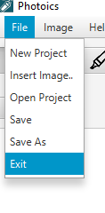

# Photoic

An Open Source Graphic Editor tool. Layer based image editing software, similar to Adobe's Photoshop

For working demo and Tutorial Videos
https://drive.google.com/open?id=12QMqd1MocllqbtcpRnPnmaSKfzWDu4VY

# Basic Features
# File Menu

1.New Project- To Create  and Work in a new project canvas

2.Insert Image- To insert image into your current working project

3.Open project- Opening existing project

4.Save- To save current project (.po format)

5.Save As- To export as a image

 

